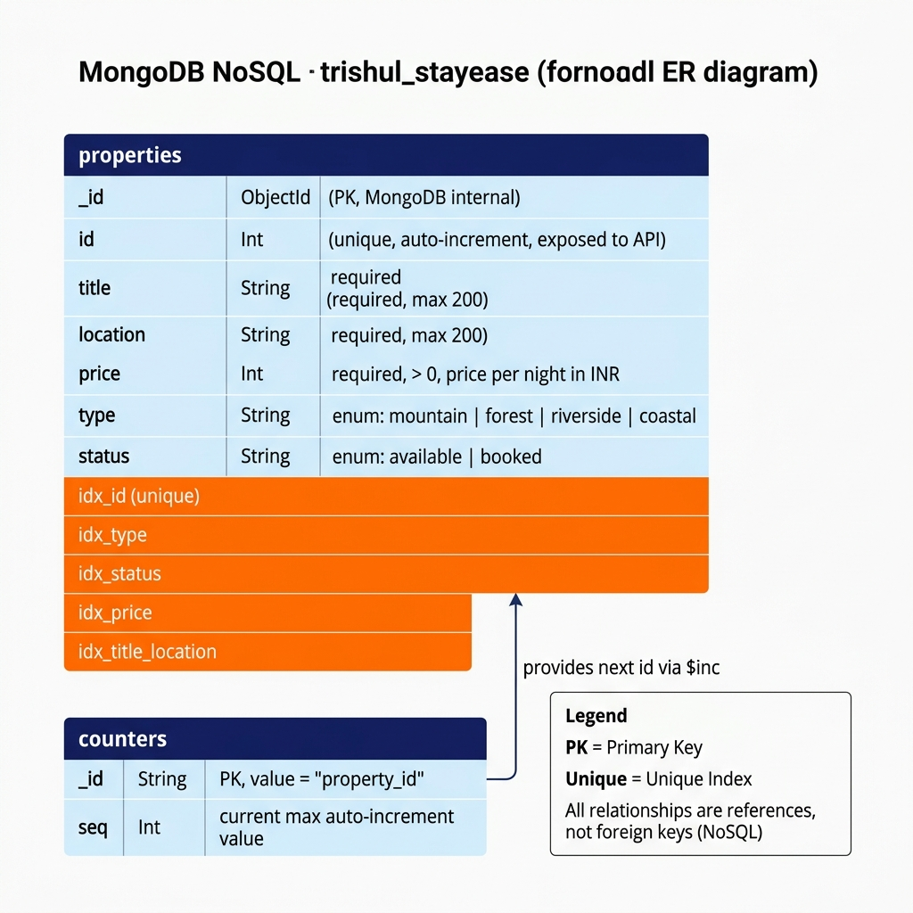
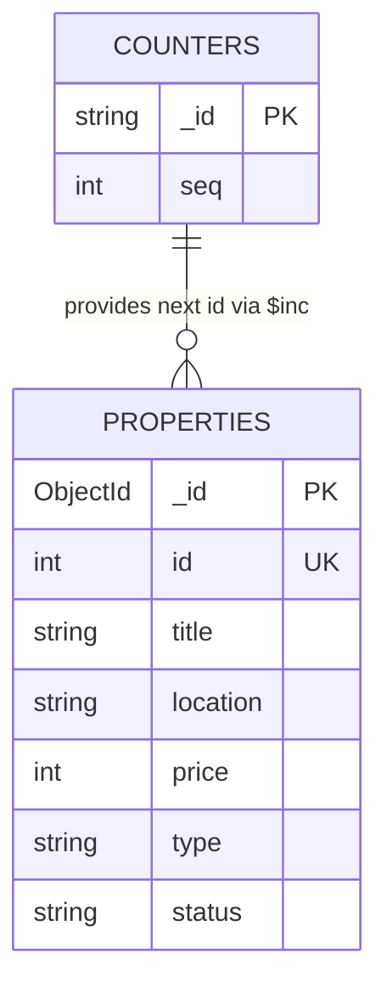

# 🏡 Trishul StayEase – Direct Booking Engine

A modern full-stack eco-homestay booking platform built with **React + Vite** (frontend) and **FastAPI + MongoDB Atlas** (backend). Helps eco-homestay owners accept direct reservations without relying on third-party OTAs.

🌐 **Live Demo:** [trishul-stay-ease.vercel.app](https://trishul-stay-ease.vercel.app)

---

## 🛠️ Tech Stack

| Layer | Technology |
|---|---|
| **Frontend** | React 19, Vite 8, React Router 7, Tailwind CSS v4, Axios |
| **Backend** | Python, FastAPI, Pydantic v2, Uvicorn |
| **Database** | MongoDB Atlas, Motor (async driver), PyMongo |
| **Styling** | Vanilla CSS + Tailwind CSS (dark mode supported) |
| **Deployment** | Vercel (Frontend) |
| **Tools** | Git & GitHub, Postman, VS Code |

---

## 📂 Project Structure

```
Trishul_StayEase/
│
├── frontend/                        # React + Vite app (deployed on Vercel)
│   ├── src/
│   │   ├── components/              # Navbar, Hero, Card, Footer
│   │   ├── components/ui/           # Button, Input, Modal, Toast, Loader
│   │   ├── contexts/                # ThemeContext (dark mode)
│   │   ├── pages/                   # Home, About, Dashboard, Login, ComponentShowcase
│   │   ├── services/
│   │   │   └── api.js               # Axios API service layer
│   │   ├── App.jsx
│   │   ├── main.jsx
│   │   └── index.css
│   ├── .env.local                   # VITE_API_URL (git-ignored)
│   ├── vercel.json                  # SPA routing config
│   └── package.json
│
├── backend/                         # FastAPI REST API + MongoDB Atlas
│   ├── main.py                      # All async routes, lifespan, CORS
│   ├── models.py                    # Pydantic v2 schemas
│   ├── database/
│   │   ├── connection.py            # Motor client — connect/disconnect
│   │   └── crud.py                  # All async CRUD operations + seed data
│   ├── schema_diagram.png           # Week 5 MongoDB ER diagram
│   ├── requirements.txt             # Python dependencies
│   ├── .env                         # Local secrets (git-ignored)
│   ├── .env.example                 # Environment variable template
│   └── README.md                    # Backend-specific docs + MongoDB setup
│
├── W4_APICollection_26100462.json   # Postman collection (Week 4 deliverable)
└── README.md                        # This file
```

---

## 🗄️ Database Schema (Week 5 — MongoDB Atlas)



Two collections in the `trishul_stayease` database:



| Collection | Purpose |
|---|---|
| `properties` | All eco-stay listings (seeded with 7 on first run) |
| `counters` | Atomic auto-increment sequence for integer `id` |

---

## 🚀 How to Run Locally

### Prerequisites
- **Node.js** v18+ and npm
- **Python** 3.10+
- **MongoDB Atlas** account (free M0 cluster)

---

### 1️⃣ Clone the repository

```bash
git clone https://github.com/Riddhi1204/Trishul_StayEase.git
cd Trishul_StayEase
```

---

### 2️⃣ Run the Backend (FastAPI + MongoDB)

```bash
# Navigate to the backend folder
cd backend

# Create and activate a virtual environment
python -m venv venv
venv\Scripts\activate          # Windows
# source venv/bin/activate     # macOS / Linux

# Install dependencies
pip install -r requirements.txt

# Set up environment variables
copy .env.example .env         # Windows
# cp .env.example .env         # macOS / Linux
```

Edit `.env` and fill in your MongoDB Atlas connection string:

```env
PORT=8000
HOST=0.0.0.0
ALLOWED_ORIGINS=http://localhost:5173,https://trishul-stay-ease.vercel.app
MONGO_URI=mongodb+srv://<user>:<password>@<cluster>.mongodb.net/?retryWrites=true&w=majority
DB_NAME=trishul_stayease
```

```bash
# Start the server
uvicorn main:app --reload --port 8000
```

> On first startup, the server automatically connects to Atlas, creates indexes, and seeds 7 eco-stay properties if the collection is empty.

✅ Backend: **http://localhost:8000**
📖 Swagger docs: **http://localhost:8000/docs**

---

### 3️⃣ Run the Frontend (React + Vite)

Open a **new terminal**:

```bash
cd frontend
npm install
echo VITE_API_URL=http://localhost:8000 > .env.local
npm run dev
```

✅ Frontend: **http://localhost:5173**

---

## 6. Security and Authentication (Week 6)

### Authentication Flow
- **JWT (JSON Web Tokens)**: Used for stateless session management.
  - Access tokens are signed using a secure secret key and expire in 24 hours.
  - The client stores the token in `localStorage` and sends it via the `Authorization: Bearer <token>` header.
- **Google OAuth**: Integrated using `@react-oauth/google` and `google-auth` on the backend for secure Google Sign-In.
- **Password Security**: Passwords are cryptographically hashed using `bcrypt` (via `passlib`).
  - Frontend includes a **password strength meter** requiring: 8+ characters, uppercase, lowercase, numbers, and special characters.

### Security Enhancements
- **Rate Limiting**: Implemented via `slowapi` on critical endpoints (`/auth/login`, `/auth/register`) to prevent brute-force and DDoS attacks.
- **Security Headers**: Custom middleware (`middleware/security.py`) implements security headers like `X-Frame-Options`, `X-Content-Type-Options`, `Strict-Transport-Security`, and restrictive `Content-Security-Policy`.
- **CORS Configuration**: Restricted allowed origins in production for better cross-origin security.
- **Data Sanitization & Limits**: Applied constraints to search queries (`max_length=100`) to prevent excessive load on database querying.

## 🌍 Production Deployment

### 1. Deploy the Backend to Render
1. Create a **Web Service** on Render and point it to your GitHub repository.
2. Set the `Root Directory` to `backend`.
3. Render will automatically detect the settings from `render.yaml`.
4. In the Render Dashboard, add the following Environment Variables:
   - `MONGO_URI`: Your MongoDB Atlas connection string.
   - `JWT_SECRET`: A secure randomly generated string.
   - `ALLOWED_ORIGINS`: `https://trishul-stay-ease.vercel.app` (or your frontend URL)

### 2. Deploy the Frontend to Vercel
1. Import your repository into Vercel.
2. Set the **Framework Preset** to `Vite`.
3. Set the **Root Directory** to `frontend`.
4. In the **Environment Variables** section, add:
   - Name: `VITE_API_URL`
   - Value: `https://your-backend-app-name.onrender.com` (Your live Render backend URL)
5. Click **Deploy**. Vercel will automatically connect to your Render backend via this variable.

---

## 🔌 API Endpoints

Base URL: `http://localhost:8000`

| Method | Endpoint | Description | Status Code |
|--------|----------|-------------|-------------|
| GET | `/api/properties` | List all properties | 200 |
| GET | `/api/properties/{id}` | Get a single property | 200 / 404 |
| POST | `/api/properties` | Create a new property | 201 |
| PUT | `/api/properties/{id}` | Update a property | 200 / 404 |
| DELETE | `/api/properties/{id}` | Delete a property | 204 / 404 |
| GET | `/api/properties/search?q=` | Search by title or location | 200 |
| GET | `/api/properties/filter?max_price=` | Filter by price / type / status | 200 |

---

## 🌿 Features

- **MongoDB Atlas** persistent storage — data survives server restarts
- **Eco-stay listings** fetched live from FastAPI + Atlas backend
- **Search** properties by name or location (debounced API calls)
- **Filter** by price, type, and availability
- **Dark mode** with system preference detection and localStorage persistence
- **Reusable UI library** — Button, Input, Modal, Toast, Loader components
- **Skeleton loading** states while fetching data
- **Error handling** with retry support
- **CORS** configured for local dev and Vercel production
- **Auto-seeding** — 7 properties inserted on first run automatically

---

## 📬 Postman Collection

Import `W4_APICollection_26100462.json` into Postman to test all endpoints with pre-filled example requests and responses.

---

## 🎓 Internship Project

**Track:** Full Stack Development Internship
**Sector:** Homestay & Eco-Tourism
**Project:** WD-05 – Direct Booking Engine (Zero Commission MVP)

---

## 👩‍💻 Author

**Riddhi Kumari**

- 🔗 LinkedIn: [linkedin.com/in/riddhi-kumari-039974383](https://www.linkedin.com/in/riddhi-kumari-039974383/)
- 🐙 GitHub: [github.com/Riddhi1204](https://github.com/Riddhi1204)

---

## 📄 License

This project is developed for educational and internship purposes.
